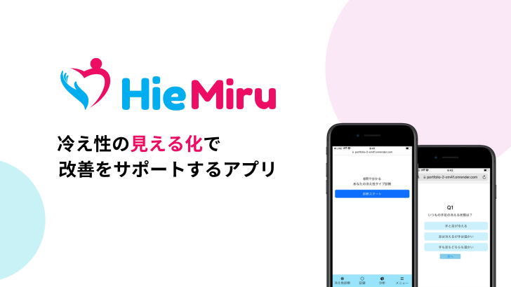

# HieMiru

## 【アプリのURL】
### [HieMiru](https://hiemiru.com/)

## Qiita記事
[GitHub Actionsでテストを自動化させてみた（Rspec ,Rubocop）](https://qiita.com/kapi819/items/91589cd0145543b09325)

## サービス概要
* 冷え性に悩んでたり、自分では気付かない隠れ冷え性の人達に向けて、【冷え性の改善をサポートする】サービスです。
* 具体的には、ユーザーに対する診断により冷え性の型及び原因を知り、掲示板での投稿機能を使い解決を図る、というものになります。

## このサービスへの思い・作りたい理由
* 私自身、「冷え性」に悩まされている一人であり、この課題は冷え性を認識し、習慣化を促せるようなアプリが必要だと思ったためです。
* 私が冷え性に悩まされ始めたのは、高校の部活動を辞め、大学受験に向けて勉強し始めた頃からです。当時、暖かい部屋で勉強をしていたにも関わらず、手足が常に冷えており、しまいには、足が赤く腫れてしまい、病院を受診したところ、霜焼けと診断され、冷えからくるものではないかと言われました。その後、友人や家族に冷え性の対処法を聞いたところ、冷えを認識している人が多い一方で、特別な対策を行なっている人は少ないことに違和感を感じました。
* ある統計では、質問に回答した人の約６割が冷え性で、男性が４割、女性の約８割が「冷え性」であるのにも関わらず、効果的な対策がわからないことを理由にして、３人に１人が対策をせず放置しているという調査結果があります。そのような自覚をしているにも関わらず、対策をしていない方や、対策を習慣化出来ていない方達に対して、解決策をアプリで提供出来るのではないかと思い、このサービスを制作することを決意しました。

## 想定されるユーザー層
* 冷え性の症状が出ているのにも関わらず、冷え性と認識していない隠れ冷え性の方
* 冷え性と認識しているが、対策をしていない方
* 冷え性と認識しており、少し対策を行なっているが、習慣化出来ていなかったり、他の対策を探している方

　冷え性に関してすでに知識があり、対策をしている方よりは、冷え性に興味を持ち始めた方を主なターゲットとしております。

## サービスの利用イメージ
* ユーザーは、ログイン前に行う冷え性診断、冷え性診断に基づいた対処策のレコメンド機能を提供することで、冷え性を意識した行動を行う最初の一歩を踏み出すきっかけになると考えています。
* Line通知による気温に合わせた服装の提案、自身で決めた改善策の通知を受け取ることが出来たり、自身で改善策の目標設定を行い、管理をすることで冷え性の改善を促していきたいです。

## ユーザーの獲得について
* 上記の調査の結果のとおり、冷え性の対策をしたことがない、または対策をしているけど、他の対策を知りたいという方は多くいると思います。アプリ専用のXのアカウントを作成し、機能や使い方を紹介するポストを投稿したり、トップページでの冷え性診断、Lineを通じたログインを使用することで、ユーザー登録を促せればと考えております。

## サービスの差別化ポイント・推しポイント
* 現在、アプリストア上で冷え性とワード検索した時にヒットする関連のアプリは無く、インターネット上にはクリニックや製薬会社が作成した記事のみがある状態です。
* インターネット上の記事だけでは、１つの記事だけでは足りないため、複数の記事を見る必要があったり、調べるだけで満足してしまい、冷え性の方に必要な習慣化を支援出来ないのではないかと考えています。
* 記事では支援出来ない習慣化について、本サービスではLINE通知を取り入れることで、冷え性の改善に必要な生活習慣を付け、アプリ使用後に冷え性の改善を見込めるサービスにできるのではないかと考えています。

## 機能一覧
|ログイン/ログアウト機能|冷え性診断機能|
|:-------------|:-------------|
|||
|ワンタップでLINEログインが可能です。|冷えに関する質問から、ユーザーの冷え性の型を表示します。|

|目標記録機能|体調記録機能|
|:-------------|:-------------|
|||
|一日一回ワンタップで目標達成の記録が可能です。|基礎体温・体重・体脂肪・体調・気分を記録し、カレンダーや棒グラフで確認することができます。|

### その他機能：
- **シェアー機能：**
  - 冷え性診断の結果をxシェアーすることができる
- **動的OGP表示機能**
- **PWA表示機能**

**本リリース後**
   1. コミュニティ機能
      - 掲示板機能

* MVP、本リリース時点でのサービスや機能は、ユーザーが個人で使用することを想定しているため、本リリース後にはコミュニティ機能を実装し、冷え性改善をしている中で生じた疑問を解決出来るようにし、アプリ内で完結出来るようにしていきたいです。

## 使用技術
| カテゴリ       | 技術                                     |
| ------------- | -------------                           |
| フロントエンド   | JavaScript / Bootstrap                 |
| バックエンド    | Ruby / Ruby on Rails                    |
| データベース    | PostgreSQL                              |
| 環境構築       | Docker                                  |
| インフラ       | Render                                  |
| Web API      | LINE Messaging API                       |
| その他 　     | Sidekiq / Redis / ActiveJob              |

## 画面推移図
[画面遷移図](https://www.figma.com/file/wqLqj8RVZpQrRhGesPe8Ec/%E3%83%9D%E3%83%BC%E3%83%88%E3%83%95%E3%82%A9%E3%83%AA%E3%82%AA?type=design&node-id=0%3A1&mode=design&t=hjroMIFOay3tew5V-1)

## ER図

